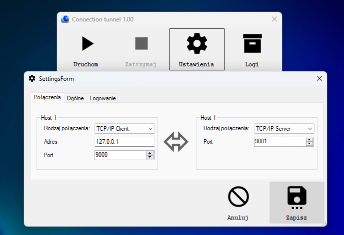

# ConnectionTunnel
_A program for two-way tunneling of communication between selected media_

# Working - in brief
Run application. In the settings, we select the connection to the first host. Then to the second one. We provide the connection parameters and save the changes.
After clicking start, the application listens on both channels. After receiving data for each, it immediately transfers the data to the next one.

# Download
Click [link](https://github.com/lukmasko/ConnectionTunnel/raw/main/ConnectionTunnel_v1.0_portable) to download portable version.

# Screen
Setting up connections between hosts

Action example

# Technology stack
C#

# Dependencies
---
    
# Authors
Łukasz Maśko (lukmasko@gmail.com)
